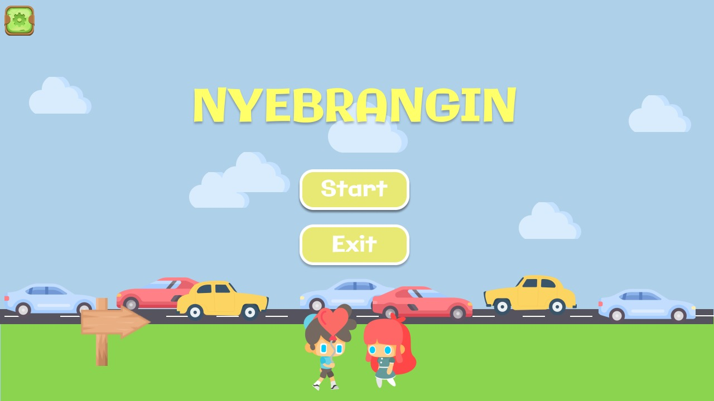

# NYEBRANGIN GAME
     Game developer by : PULANGMEN

| KELOMPOK : PULANGMEN - RB05 |
| ---------------- |

| NIM  | Nama |
| ----- | --- |
| 119140117  | Chantika Aurrelia |
| 120140149  | Dewi Anggraini  |
| 120140189  | Fanesa Hadi Pramana  |
| 120140043  | Irsan Romardi Harahap  |
| 120140071  | Muhammad Rizky Fahreza Gusti  |
| 120140039  | Tara Nadani Mozart  |

## Deskripsi Game

Game menggambarkan tentang player yang ingin membantu civillian untuk menyebrangi jalan ke tujuan yang diinginkan. 

Player memiliki 3 kali kesempatan bermain berupa nyawa yang akan berkurang setiap kali tertabrak kendaraan. 

Player mendapatkan poin saat menjalankan misi dengan durasi waktu tertentu. 

Setiap tingkatan level memiliki tingkat kesulitan game yang semakin meningkat yang dapat dilihat dari kecepatan kendaraan mobil yang berjalan.

## Dependensi Paket (library) Game 

- Pygame 
- Random

## Cara menjalankan Game (cara bermain) 

1. Menampilkan menu home : 
    - Start 
    - Exit

     
    

2. Terdapat pilihan tingkat kesulitan(level) Game : 
    - Easy 
    - Medium
    - Hard
    
     

## UML Class Diagram Game

## Kontributor Pengembangan Game
